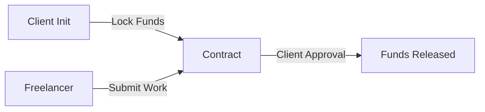

> **Stellar Developer Program — Green Belt Challenge Upgrade**
> Originally Orange Belt: A decentralized escrow application built on **Stellar Soroban** enabling trustless payments between a Client and a Freelancer. Funds are locked in a smart contract and released only when work is approved.

---
## 🟢 Green Belt Submission Criteria

- **Live Vercel Demo Link**: [(https://micro-escrow-stellar-orange-belt-if.vercel.app/)]
- **CI/CD Pipeline Badge**: [](https://github.com/Aditya-linux/Micro-Escrow-Stellar---Orange-Belt-/actions)
- **Contract Address (Testnet)**: `[Paste CCW4... Address Here]`
- **Transaction Hash (Inter-Contract Call / Fee Collection)**: `[Paste TX Hash Here]`

### 📱 Mobile View
*(Place your Mobile Screenshot here)*


---
## 📸 Screenshots

| Light Mode | Dark Mode |
|:----------:|:---------:|
|  |  |

### 🎬 Demo
📹 [**Watch the Full Demo Video**](https://drive.google.com/file/d/1z9eG-0qLOSPIsXjAgfiii24OCaNSNLM9/view?usp=sharing)

---

## 📋 Workflow

The application follows a linear, single-use contract flow to ensure security and simplicity.



| Step | Actor | Action | State Change |
| :--- | :--- | :--- | :--- |
| 1 | Client | Initializes escrow with 100 XLM and sets the Freelancer's address. | **State**: Initialized |
| 2 | Freelancer | Connects wallet and submits proof of completed work. | **State**: WorkSubmitted |
| 3 | Client | Reviews submission and approves the release of funds. | **State**: Complete |

---

## 🛠️ Tech Stack

### 🧠 Smart Contract (Backend)
- **Language**: Rust
- **Framework**: Soroban SDK (v21)
- **Tooling**: Soroban CLI (for build, deploy, and invocation)

### 💻 Frontend (Client)
- **Framework**: Next.js 16 (Turbopack)
- **Language**: TypeScript
- **Blockchain SDK**: `@stellar/stellar-sdk` v14
- **Styling**: Tailwind CSS 3
- **Icons**: Lucide React

### 🎒 Wallet Integration
Supports multiple wallet providers via dedicated adapters:
- **Freighter** (Browser Extension)
- **Albedo** (Web-based)
- **xBull** (Browser Extension)

### 🎨 Design System: Soft Neo-Brutalist
Inspired by Panda CSS and Gumroad, the UI utilizes a playful yet distinct "Soft Neo-Brutalist" aesthetic to ensure high visibility and clarity.
- **Typography**: Space Grotesk — Bold, chunky, and geometric.
- **Borders**: Thick 3px solid borders on all interactive elements.
- **Shadows**: Hard 4px offset shadows (no blur) with tactile press-down effects.
- **Palette**: Off-white background (#FFFDF7) with vibrant accents (Yellow #FFD60A, Cyan #00E5FF, Pink #FF6B9D).

---

## 📂 Project Structure

```plaintext
Micro-Escrow-DApp/
├── contract/                 # Soroban Smart Contract
│   ├── Cargo.toml            # Dependencies (soroban-sdk v21)
│   └── src/
│       ├── lib.rs            # Core logic (init, submit, release)
│       └── test.rs           # Unit tests
├── frontend/                 # Next.js Application
│   ├── src/
│   │   ├── app/              # App Router & Layouts
│   │   ├── components/       # UI Components (WalletModal, etc.)
│   │   └── context/          # React Context (Wallet & Theme)
├── screenshots/              # Documentation assets
├── deploy.ps1                # Automated deployment script
└── DEPLOYMENT_GUIDE.md       # Detailed deployment instructions
```

---

## 🚀 Getting Started

### Prerequisites
- Node.js 18+ and npm
- Rust toolchain with `wasm32-unknown-unknown` target.
- Soroban CLI: `cargo install soroban-cli`
- A funded Stellar Testnet account (install Freighter wallet).

### 1. Installation
Clone the repository and install frontend dependencies:

```bash
git clone https://github.com/Aditya-linux/Micro-Escrow-Stellar---Orange-Belt-.git
cd Micro-Escrow-Stellar---Orange-Belt-
cd frontend && npm install
```

### 2. Build & Test Contract
Compile the Rust contract to Wasm and run the unit tests:

```bash
cd ../contract
cargo build --target wasm32-unknown-unknown --release
cargo test
```

Expected Output:

```plaintext
test test::test_full_flow ... ok
test result: ok. 4 passed; 0 failed;
```

### 3. Deploy to Testnet
You can use the provided PowerShell script or deploy manually via CLI.

```powershell
# From the root directory
.\deploy.ps1
```

Copy the generated `CONTRACT_ID` and update `frontend/src/app/page.tsx`.

### 4. Run the Application

```bash
cd frontend
npm run dev
```

Open [http://localhost:3000](http://localhost:3000) to view the dApp.

---

## 🐛 Challenges & Solutions

During development, several protocol-specific challenges were encountered and resolved:

| Issue | Root Cause | Solution |
| :--- | :--- | :--- |
| **Module Conflicts** | Multiple versions of `stellar-sdk` | Removed legacy packages; standardized on `v14`. |
| **UnreachableCode** | `get_state()` panic on uninitialized data | Added `.expect("Not initialized")` handling. |
| **Invalid Contract ID** | Shell encoding corruption | Implemented clean extraction via Node.js script. |
| **txBadAuth Error** | Insufficient fees / missing auth | Increased fee to 1M stroops & added explicit address params. |
| **Context Errors** | React Context not mounting correctly | Enforced strict `Provider` wrapping in `layout.tsx`. |

---

## 📄 License
This project is licensed under the MIT License.
